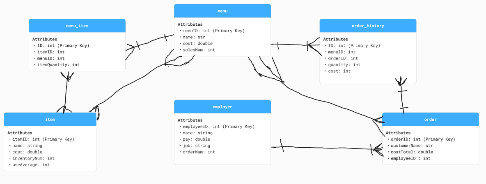

## team_matcha_project_2

CSCE 331 Project 2 (Database Dive): a **Sharetea-inspired point-of-sale (POS) relational database** meant to support a high-traffic boba shop workflow. The design focuses on:

- **Cashier-facing needs**: selecting menu items and recording orders consistently.
- **Manager-facing needs**: analyzing order history (trends / revenue) and tracking inventory usage.

The accompanying scripts in this repo create the schema, generate synthetic data (CSV), load that data into Postgres, and run a couple example analytics queries.

## Schema overview (as implemented in this repo)

- **`inventory`**: back-of-house ingredient/stock items (name, cost, in-stock count, average usage).
- **`menu`**: sellable products/drinks (name, price, sales counter).
- **`employees`**: staff metadata (name, pay, role, number of orders processed).
- **`orders`**: order “header” per transaction (customer name, total cost, employee, timestamp).
- **`order_items`**: order “line items” (which menu item, which order, quantity, item price at purchase time).

Note: the database design document also describes a **`menu_item` recipe/bridge table** (linking menu products to inventory ingredients). `db_pop.py` generates a `menu_item.csv`, but `setup_db.sql` / `pop_db.sql` do not currently create or load a corresponding table.

## UML diagram



## Repo contents

- **`setup_db.sql`**: creates the Postgres tables listed above.
- **`db_pop.py`**: generates synthetic CSVs for a year of orders (with a few peak days) and writes:
  - `inventory.csv`, `menu.csv`, `employee.csv`, `order.csv`, `order_history.csv` (for `order_items`)
  - `menu_item.csv` (generated but not loaded by default; see note above)
- **`pop_db.sql`**: loads the generated CSVs into Postgres using `\copy`.
- **`scripts_pranav.sql`**, **`scripts_anand.sql`**: example analytics queries (revenue by weekday, average order cost, weekly order counts, etc.).

## How to run (Postgres + Python)

### Prereqs

- **PostgreSQL** (and `psql` available in your terminal)
- **Python 3** (to run `db_pop.py`)

### Create tables

From the repo root:

```bash
psql -d team_13_db -f setup_db.sql
```

### Generate CSV data

From the repo root:

```bash
python db_pop.py
```

This writes the CSV files into the current directory (repo root).

### Load CSVs into Postgres

From the repo root:

```bash
psql -d team_13_db -f pop_db.sql
```

Because `pop_db.sql` uses `\copy`, run `psql` from the directory containing the CSVs (the repo root after running `db_pop.py`).

### Run example analysis queries

```bash
psql -d team_13_db -f scripts_pranav.sql
psql -d team_13_db -f scripts_anand.sql
```
